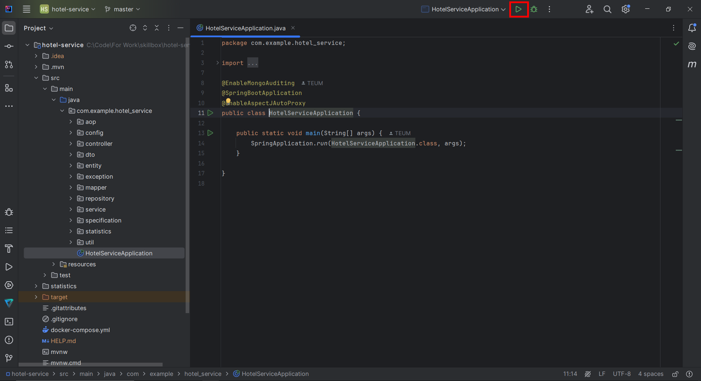

# Hotel-service

Проект представляет собой backend для бронирования отелей, разработанную на Spring Framework.
Система предоставляет функциональность для управления отелями, комнатами, пользователями и бронированиями,
а также включает разделение пользователей по ролям, что позволяет осуществлять администрирование панель для управления и
сбора статистики.

## Описание проекта

1. **Система позволяет пользователям:**:
    - Искать отели и комнаты по различным критериям.
    - Бронировать комнаты на выбранные даты.
    - Оставлять оценки отелям.
2. **Администраторы могут**:
    - Управлять отелями и комнатами.
    - Просматривать статистику по бронированиям и регистрациям пользователей.
    - Выгружать статистические данные в CSV-файл.

## Функциональность

1. **Управление отелями**:
    - CRUD-операции для отелей (пользователи могут только просматривать).
    - Фильтрация и пагинация списка отелей.
    - Обновление рейтинга отелей на основе оценок пользователей.
2. **Управление комнатами**:
    - CRUD-операции для комнат (пользователи могут только просматривать).
    - Фильтрация и пагинация списка комнат.
3. **Управление пользователями**:
    - Регистрация пользователей.
    - Аутентификация и авторизация (применяется Basic Auth в Spring Security).
4. **Бронирование**:
    - Бронирование комнат на указанные даты (выполняется проверка доступности комнат).
    - Просмотр списка бронирований (доступно только администраторам).
5. **Статистика**:
    - Сбор данных о регистрациях и бронированиях (доступно только администраторам).
    - Выгрузка статистики в CSV-файл (доступно только администраторам).

## API Endpoints

Backend состоит из следующих REST API endpoints:

### 1. Отели

- GET /api/hotels/{id} - Получить отель по ID

```json
{
  "id": "3fa85f64-5717-4562-b3fc-2c963f66afa6",
  "name": "Grand Hotel",
  "title": "Luxury 5-star hotel",
  "country": "Russia",
  "city": "Moscow",
  "district": "Central",
  "street": "Tverskaya",
  "postalCode": "125009",
  "buildingNumber": 10,
  "floor": 5,
  "apartment": "Suite 101",
  "distanceFromCentreCity": 1.5,
  "rating": 4.8,
  "countEstimation": 125,
  "createTime": "2023-01-15T10:00:00",
  "updatedTime": "2023-06-20T15:30:00"
}
```

- GET /api/hotels - Получить список отелей (с пагинацией)

```json
{
  "items": [
    {
      "id": "3fa85f64-5717-4562-b3fc-2c963f66afa6",
      "name": "Grand Hotel",
      "title": "Luxury 5-star hotel",
      "country": "Russia",
      "city": "Moscow",
      "district": "Central",
      "street": "Tverskaya",
      "postalCode": "125009",
      "buildingNumber": 10,
      "floor": 5,
      "apartment": "Suite 101",
      "distanceFromCentreCity": 1.5,
      "rating": 4.8,
      "countEstimation": 125,
      "createTime": "2023-01-15T10:00:00",
      "updatedTime": "2023-06-20T15:30:00"
    }
  ],
  "currentPage": 0,
  "pageSize": 10,
  "totalItems": 1,
  "totalPages": 1
}
```

- GET /api/hotels/filter - Фильтрация отелей

| Параметр           | Тип     | Обязательный | По умолчанию | Описание                            |
|--------------------|---------|--------------|--------------|-------------------------------------|
| id                 | string  | No           | -            | Фильтр по идентификатору отеля      |
| name               | string  | No           | -            | Фильтр по названию отеля            |
| title              | string  | No           | -            | Фильтр по заголовку/описанию отеля  |
| address            | string  | No           | -            | Фильтр по адресу отеля              |
| distanceFromCenter | double  | No           | -            | Расстояние от центра города (в км)  |
| minRating          | double  | No           | -            | Минимальный рейтинг отеля (1-5)     |
| minEstimationCount | integer | No           | -            | Минимальное количество оценок отеля |
| page               | integer | No           | 0            | Номер страницы (начиная с 0)        |
| size               | integer | No           | 10           | Количество элементов на странице    |
| sortBy             | string  | No           | "name"       | Поле для сортировки                 |

- POST /api/hotels - Создать отель

```json
{
  "name": "New Hotel",
  "title": "Comfortable 4-star hotel",
  "country": "Russia",
  "city": "Saint Petersburg",
  "district": "Central",
  "street": "Nevsky Prospect",
  "postalCode": "191186",
  "buildingNumber": 25,
  "floor": 3,
  "apartment": "Deluxe Room",
  "distanceFromCentreCity": 0.5
}
```

- PUT /api/hotels/{id} - Обновить информацию об отеле

```json
{
  "name": "New Hotel",
  "title": "Comfortable 4-star hotel",
  "country": "Russia",
  "city": "Saint Petersburg",
  "district": "Central",
  "street": "Nevsky Prospect",
  "postalCode": "191186",
  "buildingNumber": 25,
  "floor": 3,
  "apartment": "Deluxe Room",
  "distanceFromCentreCity": 0.5
}
```

- DELETE /api/hotels/{id} - Удалить отель

- POST /api/hotels/mark - Обновить рейтинг отеля

```json
  {
  "hotelId": "3fa85f64-5717-4562-b3fc-2c963f66afa6",
  "oldRating": 4,
  "newRating": 5
}
```

### 2. Комнаты

- GET /api/rooms/{id} - Получить комнату по ID

```json
{
  "id": "4fa85f64-5717-4562-b3fc-2c963f66afb7",
  "name": "Deluxe Suite",
  "description": "Spacious room with sea view",
  "number": 101,
  "price": 15000.00,
  "maxPeopleCount": 3
}
```

- GET /api/rooms - Получить список комнат (с пагинацией)

```json
{
  "items": [
    {
      "id": "4fa85f64-5717-4562-b3fc-2c963f66afb7",
      "name": "Deluxe Suite",
      "number": 101,
      "price": 15000.00,
      "maxPeopleCount": 3
    }
  ],
  "currentPage": 0,
  "pageSize": 20,
  "totalItems": 1,
  "totalPages": 1
}
```

- GET /api/rooms/filter - Фильтрация комнат

| Параметр       | Тип     | Обязательный | По умолчанию | Описание                                 |
|----------------|---------|--------------|--------------|------------------------------------------|
| id             | string  | No           | -            | Фильтр по идентификатору номера          |
| name           | string  | No           | -            | Фильтр по названию номера                |
| hotelId        | string  | No           | -            | Фильтр по ID отеля                       |
| minPrice       | double  | No           | -            | Минимальная цена за ночь                 |
| maxPrice       | double  | No           | -            | Максимальная цена за ночь                |
| maxPeopleCount | integer | No           | -            | Максимальное количество человек в номере |
| checkInDate    | date    | No           | -            | Дата заезда (формат YYYY-MM-DD)          |
| checkOutDate   | date    | No           | -            | Дата выезда (формат YYYY-MM-DD)          |
| page           | integer | No           | 0            | Номер страницы (начиная с 0)             |
| size           | integer | No           | 20           | Количество элементов на странице         |
| sortBy         | string  | No           | "name"       | Поле для сортировки                      |

- POST /api/rooms - Создать комнату

```json
{
  "name": "Standard Room",
  "description": "Comfortable room with city view",
  "number": 201,
  "maxPeopleCount": 2,
  "price": 8000.00,
  "hotelId": "3fa85f64-5717-4562-b3fc-2c963f66afa6"
}
```

- PUT /api/rooms/{id} - Обновить информацию о комнате

```json
{
  "name": "Standard Room",
  "description": "Comfortable room with city view",
  "number": 201,
  "maxPeopleCount": 2,
  "price": 8000.00,
  "hotelId": "3fa85f64-5717-4562-b3fc-2c963f66afa6"
}
```

- DELETE /api/rooms/{id} - Удалить комнату

### 3. Пользователи

- GET /api/users/{id} - Получить пользователя по ID

```json
{
  "id": "6fa85f64-5717-4562-b3fc-2c963f66afc9",
  "name": "Иван Иванов",
  "email": "ivan@example.com",
  "bookings": [
    {
      "id": "7fa85f64-5717-4562-b3fc-2c963f66afd0",
      "roomId": "4fa85f64-5717-4562-b3fc-2c963f66afb7",
      "checkInDate": "2023-07-15",
      "checkOutDate": "2023-07-20"
    }
  ]
}
```

- GET /api/users - Получить список пользователей (с пагинацией)

```json
{
  "items": [
    {
      "id": "2928fe00-b51a-4789-9f7b-35b5b656cde9",
      "name": "username",
      "email": "prosot@mail.ru",
      "bookings": [
        {
          "id": "5585a683-2b93-4a02-a1e4-86b4a8b41478",
          "checkInDate": "2025-06-25",
          "checkOutDate": "2025-07-02"
        },
        {
          "id": "a383f8af-383c-4780-bcce-cd554aba3492",
          "checkInDate": "2025-10-25",
          "checkOutDate": "2025-12-02"
        }
      ]
    }
  ],
  "currentPage": 0,
  "pageSize": 20,
  "totalItems": 1,
  "totalPages": 1
}
```

- POST /api/users/login - Создать пользователя (регистрация)

```json
{
  "login": "new_user",
  "password": "securePassword123",
  "email": "new@example.com",
  "role": "USER"
}
```

- PUT /api/users/{id} - Обновить информацию о пользователе

```json
{
  "login": "updated_user",
  "password": "newSecurePassword456",
  "email": "updated@example.com",
  "role": "ADMIN"
}
```

- DELETE /api/users/{id} - Удалить пользователя

### 4. Бронирование

- POST /api/bookings - Создать бронирование
```json
{
  "roomId": "4fa85f64-5717-4562-b3fc-2c963f66afb7",
  "checkInDate": "2023-08-01",
  "checkOutDate": "2023-08-07"
}
```

- GET /api/bookings - Получить список бронирований (с пагинацией)
```json
{
  "items": [
    {
      "id": "9ia85f64-5717-4562-b3fc-2c963f66aff3",
      "checkInDate": "2023-08-01",
      "checkOutDate": "2023-08-07",
      "status": "CONFIRMED"
    },
    {
      "id": "0ja85f64-5717-4562-b3fc-2c963f66ag04",
      "checkInDate": "2023-09-15",
      "checkOutDate": "2023-09-20",
      "status": "PENDING"
    }
  ],
  "currentPage": 0,
  "pageSize": 10,
  "totalItems": 2,
  "totalPages": 1
}
```

### 5. Сбор статистики

- GET /api/statistics/export - экспортировать статистику в виде CSV-файла

## Детали реализации

### Взаимодействие

- Веб сервис на базе Spring MVC.
- Rest Full Api.

### Безопасность

- Spring Security с Basic Auth
- Ролевая модель (USER, ADMIN)
- Безопасность на уровне enpoints

### Хранение данных

- Данные сущностей хранятся в базе данных PostgreSQL. Применяется ORM.
- Данные статистики хранятся в базе данных MongoDB.
- JPA Specification - для динамических запросов.
- Предложен вариант реализации хранения любого типа события в базе данных статистики.

## Стек технологий

- **Язык программирования**: Java
- **Фреймворк**: Spring Boot, Spring MVC, Spring Data, Hibernate
- **База данных**: PostgreSQL, MongoDB
- **Брокер сообщений**: Kafka
- **Библиотеки**:
    - MapStruct - для маппинга объектов.
    - Lombok — для упрощения кода.
- **Инструменты**:
    - Maven — для управления зависимостями.
    - Docker - для контейнеризации.
    - Git — для контроля версий.

## Установка и запуск

### Требования

- Java 17+
- MySQL 8.0+
- Maven 3.6+
- PostgreSQL 13+
- MongoDB 5.0+
- Kafka 3.6+

### Установка

```bash
git clone https://github.com/StLuka02022002/hotel-service
```

### Запуск MySQL и создание базы данных

```sql
CREATE DATABASE hotels_db
```

### Открыть проект и запустить его в IDE



### Использовать сборщик Maven

```bash
mvn clean package
java -jar target/hotel-service-1.0-SNAPSHOT.jar
```

### Использование движка

Откройте в браузере: http://localhost:8080